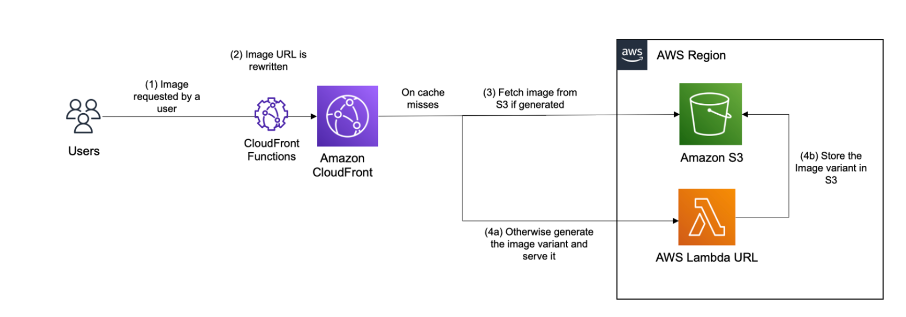
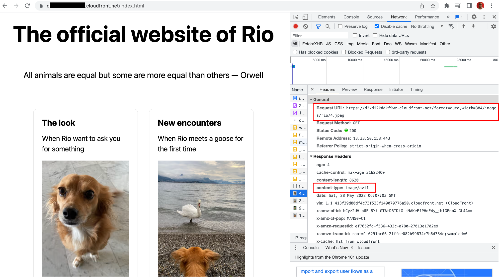

# Blog - Image Optimization using CloudFront 

## Introduction

Images are usually the [heaviest](https://almanac.httparchive.org/en/2021/page-weight#fig-2) components of a web page, both in terms of bytes and number of HTTP requests. Optimizing images on your website is critical to improve your users experience, reduce your delivery costs and enhance your position in search engine ranking. For example, Google’s Largest Contentful Paint metric in their search ranking algorithm is highly impacted by how much you optimize the images on your website. In the blog post, we provide you with a simple and performant solution for image Optimization using serverless components such as Amazon CloudFront, Amazon S3 and AWS Lambda. Then, we illustrate this solution in a sample web page built using Next.js, a popular framework used by developers to build websites. 


## Image optimization architecture

An Image optimization solution can be architected in different ways, according to the tradeoffs (cost, flexibility, performance & complexity) that best meet your business. When architecting an Image optimization solution, you need to make the following technical decisions:

* What image transformations are needed? formatting, resizing, cropping, etc..
* How do we decide which transformation to be applied for a specific image request? On the Front-end (static, responsive design, etc..), on the Edge side (based on request content such as device) or combination of both?
* Where do we execute the transformation? In a central location or in a distributed way?
* When do we execute the transformation? Every time or do we store transformed images for a short duration? Synchronously or Asynchronously?

The proposed architecture is suitable for most common use cases. Images transformation are executed centrally in an AWS region, only when the image hasn’t been already transformed and stored. The available transformations include resizing and formatting, but can be extended to more operations if needed. Both transformations can be requested by the Front-end, with the possibility of automatic format selection done on edge side. The architecture is based on S3 for storage, CloudFront for content delivery, and Lambda for image processing. The request flow is explained in the next diagram:



1. The user sends a HTTP request for an image specific transformations, such as encoding and size. The transformations are encoded in the URL, more precisely as comma-separated list of directives as a prefix to the original path.  An example URL would look like this: https://exmaples.com/format=webp,width=200/images/cats/mycat.jpg. 
2. The request is processed by a nearby CloudFront Edge location providing the best performance. Before passing the request upstream, a CloudFront Function is executed on viewer request event to rewrite the request URL. CloudFront Functions is a feature of CloudFront that allows you to write lightweight functions in JavaScript for high-scale, latency-sensitive CDN customizations. In our architecture, we rewrite the URL to:
    1. Validate the requested transformations.
    2. Normalize the URL by ordering transformations and convert them to lower case to increase the cache hit ratio.
    3. When an automatic transformation is requested, decide about the best one to apply. For example, if the user asks for the most optimized image format (JPEG, WebP, or AVIF) using the directive `format=auto`, CloudFront Function will select the best format based on the Accept header present in the request.
3. If the requested image is already cached in CloudFront then there will be a cache hit and the image is returned from CloudFront cache. To increase the cache hit ratio, we enable [Origin shield](https://docs.aws.amazon.com/AmazonCloudFront/latest/DeveloperGuide/origin-shield.html), a feature of CloudFront that reduces even more the number of requests to the origin. If the Image is not in CloudFront cache, then the request will be forwarded to S3 . If the requested image is already transformed and stored in S3, then it is simply served and cached in CloudFront.
4. Otherwise, S3 will respond with a 403 error code, which is detected by CloudFront’s [Origin Failover](https://docs.aws.amazon.com/AmazonCloudFront/latest/DeveloperGuide/high_availability_origin_failover.html). Thanks to this native feature, CloudFront retries the same URL but this time using the secondary origin based on Lambda URL. When invoked, the Lambda function downloads the original image from S3, transforms it using [Sharp library](https://sharp.pixelplumbing.com/), stores the transformed image in S3, then serve it through CloudFront where it will be cached for future requests. Note the following:
    1. The transformed image is added to S3 with a lifecycle policy that deletes it after a certain duration to reduce the storage cost. Ideally, you’d set this value according to the duration after which your images stop being popular.
    2. For additional access control, CloudFront is configured to send a secret key in a [Custom origin header](https://docs.aws.amazon.com/AmazonCloudFront/latest/DeveloperGuide/add-origin-custom-headers.html), which is validated in the Lambda code before processing the image.


## Deploy solution using CDK 

CDK is an open-source software development framework to define cloud infrastructure in code and provision it through AWS CloudFormation. Follow these steps in your command line to deploy the image optimization solution using CDK, using the region and account information [configured in your AWS CLI](https://docs.aws.amazon.com/cli/latest/userguide/cli-configure-quickstart.html). Note that for testing purposes, we gave the `cdk deploy` command a context parameter to delete created S3 bucket with the files on it. In a production setup, it’s safer to change it to false, and remove the bucket if needed manually.

```
git clone https://github.com/achrafsouk/image-transformation.git
cd image-transformation
npm install
cdk bootstrap
npm run build
cdk deploy -c S3_REMOVE_EMPTY_AFTER_CDK_DESTROY=true
```

When the deployment is completed within minutes, the CDK output will include the name of the created S3 bucket, and three URL, one pointing to an original image, and two others illustrating requests to transform images. Test both links to verify that it is working properly.


## Use the solution on a Next.js web page with responsive design

In this section, we will create a simple web page using Next.js, and use the previously deployed Image solution to optimize the image. Start a [new Next.js project](https://nextjs.org/docs/api-reference/create-next-app) by typing the following in your command line:

```
npx create-next-app@latest
```

Navigate to your project folder. Modify the file `package.json` by changing the build script to allow exporting the build files to S3:

```
"build": "next build && next export",
```

In the `pages` directory, you can find the file `index.js` which contains the code of your web page. Then update the `index.js` to the following code:

```
import Head from 'next/head'
import styles from '../styles/Home.module.css'
import Image from 'next/image'

const myLoader = ({ src, width, quality }) => {
    if (quality) { 
        return `/format=auto,quality=${quality},width=${width}${src}`;
    } else return `/format=auto,width=${width}${src}`;
}

export default function Home() {
    return (
        <div className={styles.container}>
            <Head>
                <title>Next App with optimized images</title>
                <meta name="description" content="Generated by create next app" />
                <link rel="icon" href="/favicon.ico" />
            </Head>

            <main className={styles.main}>
            <h1 className={styles.title}>The official website of Rio</h1>
            <p className={styles.description}> All animals are equal but some are more equal than others — Orwell</p>
            <div className={styles.grid}>
                <div className={styles.card}>
                    <h2>The look</h2>
                    <p>When Rio want to ask you for something</p><br/>
                    <Image src="/images/rio/4.jpeg" loader={myLoader} layout="responsive" sizes="20vw" width={900} height={1200}/>
                </div>
                <div className={styles.card}>
                    <h2>New encounters</h2>
                    <p>When Rio meets a goose for the first time</p><br/>
                    <Image src="/images/rio/3.jpeg" loader={myLoader} layout="responsive" sizes="20vw" width={900} height={1200}/>
                </div>
                <div className={styles.card}>
                    <h2>Happiness</h2>
                    <p>When Rio go and play at the beach</p><br/>
                    <Image src="/images/rio/1.jpeg" loader={myLoader} layout="responsive" sizes="20vw" width={900} height={1200}/>
                </div>
                    <div className={styles.card}>
                    <h2>In love</h2>
                    <p>When Rio fall in love.. with Flo the neighboor dog</p><br/>
                    <Image src="/images/rio/2.jpeg" loader={myLoader} layout="responsive" sizes="20vw" width={900} height={1200}/>
                </div>

            </div>
            </main>
        </div>
    )
}
```

Instead of setting the image width statically in the Front-end using the traditional HTML `Img` component,  we implemented responsive design using the [Image component](https://nextjs.org/docs/api-reference/next/image) of Next.js. This component automatically selects the best image size for a specific user screen, and provides additional benefits such as lazy loading. To use our image optimization solution as a provider to the Image component of Next.js, change `module.exports` in the `next.config.js` file to:

```
module.exports = {
    images: {
      loader: 'custom',
    },
  }
```

Note that in the `index.js`, we implemented the custom loader, which tells next.js how to construct image URL to our image optimization provider. 

Deploy the site to the bucket created in the previous section using the AWS CLI:

```
rm -r out
npm run build
aws s3 cp out s3://YOUR_BUCKET_NAME/ --recursive
```

Navigate to the deployed web page (`/index.html`) in a Chrome browser using the previously generated CloudFront domain name. Using developer tools, check the requested images size based on the viewport. For example, you can verify responsiveness by emulate a mobile device rendering in Chrome. Finally, if you are using a recent Chrome browser, you can see that images are returned in the modern AVIF format since they were requested with the `format=auto` directive.



## Cost considerations

The cost of this solution, excluding the Image delivery and the storage of original images, is based on multiple components, which depends on your image library size, traffic patterns, and your configuration. To illustrate the cost calculation, consider 100 thousands original images with a 500Kb average size; 24 variants requested for each original image, with an average size of 30Kb; 20% of the image library is renewed on a monthly basis; 1 million image requests per month from US/EU region , with an average of 95% Cache Hit Ratio. 

* The cost of storing images on S3 in us-east-1 with Standard Tier equals to (100000*500 +100000*24*40)/1024/1024*0.023 = 3.2 $/month. 
* The cost of transforming images using a Lambda function with 1800MB memory and an average execution duration of 90 ms, equals 100000*0.2*24*90*1800/1024 * 0.0000166667  = 1.26 $/month. In addition, we need to account for the cost of downloading then uploading transformed images to S3 (GET & PUT requests), which is equal to 100000*0.2*24*(0.005 + 0.0004)/1000 = 2.6 $/month.
* The cost of delivery using CloudFront equals the sum of different components:
    * CloudFront Data transfer to internet equals 1000000*30/1024/1024*0.085=2.4 $/month. 
    * CloudFront Request fees equals 1000000*0.0075/10000=0.75 $/month. 
    * CloudFront Functions equals 0.1 $/month. 
    * The cost of S3 GET requests and Origin Shield requests on cache misses is marginal.

In total, the cost would be around 10 $/month. In reality, it will be closer to 6$ /month thanks to the (Always) Free tiers of CloudFront and Lambda. You can optimize the cost of this solution according to your business needs by dialling up or down parameters like S3 object retention period or [Lambda memory configuration](https://docs.aws.amazon.com/lambda/latest/operatorguide/profile-functions.html), by changing S3 storage tier, by reconsidering the need for storing transformed images in S3 or by using [ARM based Lambda](https://aws.amazon.com/blogs/aws/aws-lambda-functions-powered-by-aws-graviton2-processor-run-your-functions-on-arm-and-get-up-to-34-better-price-performance/). 


## Clean up resources

To remove cloud resources created for this solution, just execute the following command:

```
cdk destroy
```


## Conclusion

In this blog, you have have deployed a simple and performant image optimization solution, then you have used it in a sample web page based on the popular framework Node.js. From this starting point, you can customize further this solution for your business needs. For example, you can add new image transformations, normalize operations to a predefined set of possibilities, or implement a personalized image monitoring dashboard.
* * *

## Next steps:

* Improvements:
    * Simplify npm build/install
    * Review which security headers to include
    * Multiple deployments within an account lead to error (Response policies and CloudFront Functions-
* Test the solution with a customer in production, and optimize performance
    * Performance of S3 GET in Lambda (HTTP instead of HTTP? keep alive working? [multipart dowbload](https://github.com/awslabs/s3-managed-download-js)?)
    * Can performance be improved with ARM based processor?
* Transform Solution into a CDK construct
* Try image streaming when available to optimize time to first byte
* Consider influencing Serverless solution and Image handler solution

